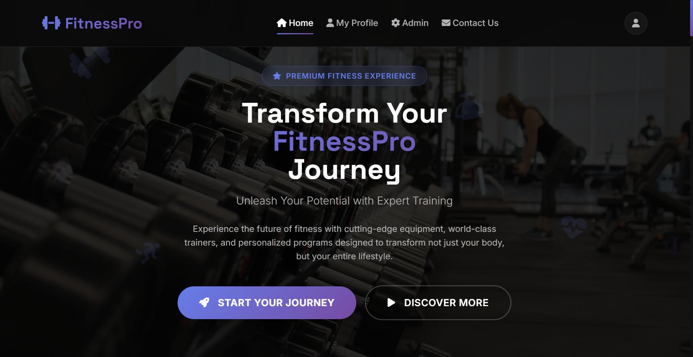
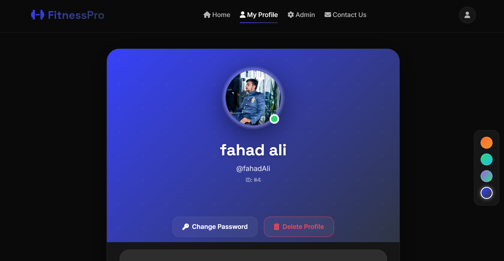
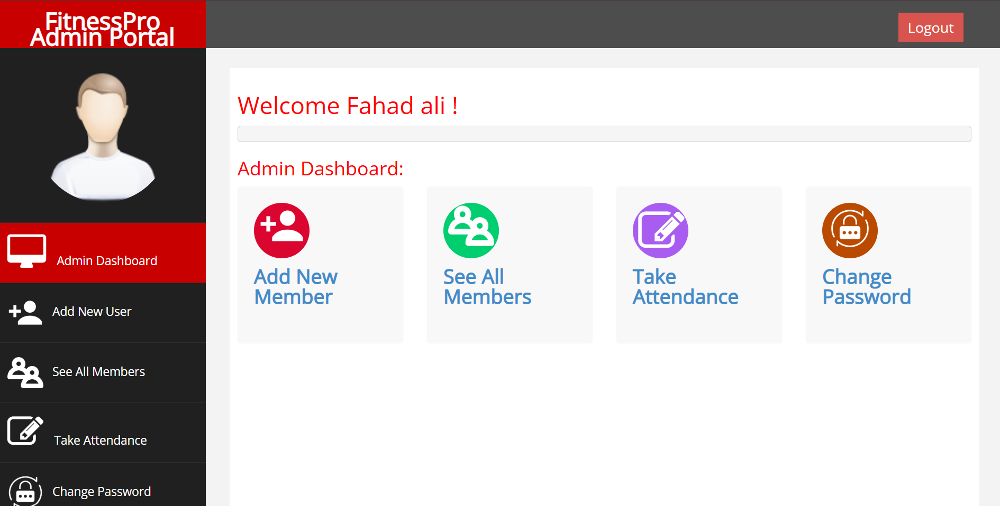

# 🏋️‍♂️ FitnessPro – Django Gym Management App

**FitnessPro** is a role-based gym management system built with **pure Django**. It allows gym members to access personalized exercise and diet plans, while gym admins can manage users, attendance, and more through a secure dashboard.

---

## 🚀 Features

### 👤 User Panel
- 🔐 User login & signup
- 📅 View today’s exercise
- 🥗 View diet plan
- 🗑️ Delete profile
- 🔒 Change password

### 🛠️ Admin Panel (Gym Manager)
- ➕ Add new users
- ✅ Take attendance
- 👥 View all members
- 🔑 Change password

---

## 🛠️ Tech Stack

- **Backend:** Django (Python)
- **Database:** SQLite (or PostgreSQL)
- **Frontend:** Django Templates (HTML, CSS)
- **Auth:** Django’s built-in auth system

---

## 📸 Screenshots

### 🏠 Homepage



The homepage shows featured exercises and clean navigation for gym users.

### 🙍‍♂️ User Panel



Users can view their assigned workout for the day, check their diet plan, and manage their profile settings.

### 🛠️ Admin Panel



Gym admins can add users, take attendance, and manage member data securely from the dashboard.


---

## ⚙️ How to Run Locally

```bash
# 1. Clone the repository
git clone https://github.com/FAHAD-ALI-github/FITNESSPRO_DJANGO.git
cd FITNESSPRO_DJANGO

# 2. Create virtual environment & activate
python -m venv env
source env/bin/activate  # On Windows: env\Scripts\activate

# 3. Install dependencies
pip install -r requirements.txt

# 4. Run migrations
python manage.py makemigrations
python manage.py migrate

# 5. Create superuser (for admin access)
python manage.py createsuperuser

# 6. Run the server
python manage.py runserver
```


---

## 📂 Folder Structure

```
FITNESSPRO_DJANGO/
│
├── FITNESSPRO/              # Django project folder
├── gym/                     # Main app containing models, views, templates
├── admin_images/            # Admin saved images
├── users_profile_images/    # Users profile images
├── screenshots/             # Project live demo screenshots
├── db.sqlite3               # Database file
├── manage.py
└── requirements.txt
```

---

## 🙌 Acknowledgements

- Built as a university/portfolio project
- Inspired by real-world gym operations

---

## 📫 Contact

Fahad Ali  
[LinkedIn](https://www.linkedin.com/in/fahadali1078) • [GitHub](https://github.com/FAHAD-ALI-github)
